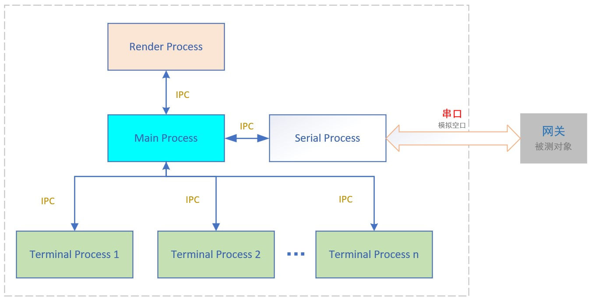

# Protocol Tester

**Protocol Tester** 通过模拟多个终端、来测试运行在网关的MAC层协议

空中接口是通过UART来模拟的


## 架构
这是一个多进程的程序，采用 **[Nodejs](https://nodejs.org) + [Electron](https://www.electronjs.org) + [Vue](https://vuejs.org) + [sqlite](https://www.sqlite.org)** 技术栈



- **Main Process**：Electron 主进程, 是其它所有进程的父进程
- **Render Process**: Electron 渲染进程
- **Serial Process**（代码文件是 ota_interface/radio_process.js）：串口读写进程，连接串口时生成
- **Terminal Process**: 终端进程，模拟终端的行为，可以创建多个
- **Main Process** 通过 [IPC](https://en.wikipedia.org/wiki/Inter-process_communication) 连接了所有其它进程

## 基本流程
1. Serial Process 会将从串口收到的包发给Main Process
2. Main Process 先解析这个包。无论包结构是正确还是错误，都会存入数据库，并稍后被渲染进程在主界面上显示出来
3. Main Process 还会把解析无误的包广播给所有的 Terminal Process 待处理
4. Terminal Process 会接受以自己为目的地的包，并根据协议规定和自己的配置（***终端配置***）来决定如何响应这个包：

   有可能给网关回一个协议规定的包作为响应，也有可能*故意*不响应，或者响应一个错误的包，等等。
5. Terminal Process 会把响应包发给 Main Process，Main Process再传递给Serial Process待发送
6. 发给 Serial Process 的包（也就是将要发给网关的包），也会记录在数据库中，并稍后被渲染进程取出来显示在主界面上

> 可编辑的 ***终端配置*** 如下：
```json
{
  device_id: 1,  //终端的device id
  on: [
    {
      msg_type: "query",  //针对收到协议的 'query' frame
      ack: true,  //是否需要根据协议的规定响应一个frame给网关
      delay_min: 50,  //响应前的最小延迟(ms)。如果delay_rand=false，实际延迟使用这个值
      delay_max: 500,  //响应前的最大延迟(ms)。如果delay_rand=true，实际延迟使用[delay_min, delay_max]之间的随机值
      delay_rand: false,  //是否开启随机延迟
      bad_crc: false  //是否故意响应一个CRC错误的包
    },
    {
      msg_type: "down",  // 针对收到协议的 'down' frame
      ack: true,
      delay_min: 50,
      delay_max: 500,
      delay_rand: false,
      bad_crc: false
    }
  ]
}
```
如果针对收到的某种frame，缺乏相应的配置，那么会根据协议规定响应一个CRC正确的包，并且使用默认延迟。


## Project Setup

```sh
npm install
```

### UI only: Compile and Hot-Reload for Development

```sh
npm run dev
```

### UI only: Compile and Minify for Production

```sh
npm run build
```

### ELECTRON & UI : Compile and Hot-Reload for Development

```sh
npm run electron:dev
```

###  ELECTRON & UI: build distributable

```sh
npm run make
```

### try the following if network is "bad"
1. scientific surfing...
2. set envionment variable as: $env:ELECTRON_MIRROR="https://npmmirror.com/mirrors/electron/"  (powershell)
3. npm config set proxy as: npm config set registry=https://registry.npmmirror.com
4. use cnpm to replace npm. to install: npm install -g cnpm --registry=https://registry.npmmirror.com