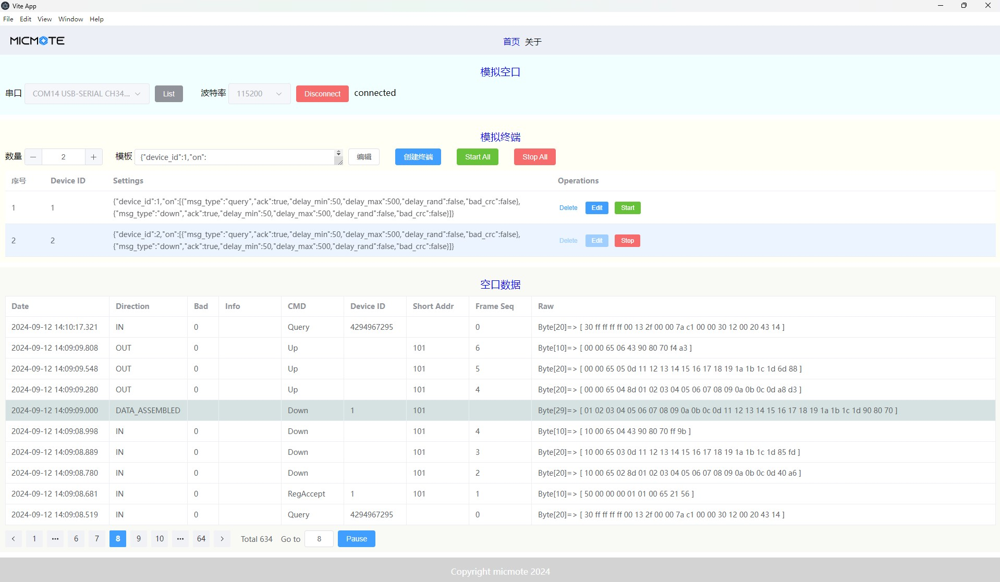

# Protocol Tester

模拟多个终端来测试运行在网关的MAC层协议



## 架构
这是一个多进程的程序，采用Nodejs + Electon + Vue技术栈


- Main Process：Electron主进程
- Render Process: Electron渲染进程
- Serial Proecss：串口读写进程，连接串口时生成，断开串口时删除
- Terminal Process: 终端进程，模拟终端的行为，可以创建多个

Main Process通过IPC连接了所有其它进程

## 基本流程
- Serial Process会将从串口收到的包发给Main Process
- Main Process解析这个包，无论包结构是正确还是错误，都会存入数据库，并稍后被渲染进程在主界面上显示出来
- Main Process还会把解析无误的包广播给所有的Terminal Process待处理
- Terminal Process会接受以自己为目的地的包，并根据协议规定和自己的配置，决定如何响应这个包：有可能给网关发一个协议规定的包作为响应，也有可能故意不响应，或者响应一个错误的包，等等
- Terminal Process会把响应包发给Main Process，Main Process再传递给Serial Process待发送
- 发给网关的包，也会记录再数据库中，并稍侯被渲染进程取出来显示

终端配置如下：
```json
{
  device_id: 1, // 终端的device id
  on: [
    {
      msg_type: "query", // 针对收到协议的 'query' frame
      ack: true,  // 是否需要根据协议的规定响应一个frame给网关
      delay_min: 50, // 响应前的最小延迟(ms)。如果delay_rand=false，实际延迟使用这个值
      delay_max: 500, // 响应前的最大延迟(ms)。如果delay_rand=true，实际延迟使用[delay_min, delay_max]之间的随机值
      delay_rand: false, // 是否开启随机延迟
      bad_crc: false // 是否故意响应一个CRC错误的包
    },
    {
      msg_type: "down", // 针对收到协议的 'down' frame
      ack: true,
      delay_min: 50,
      delay_max: 500,
      delay_rand: false,
      bad_crc: false
    }
  ]
}
```
如果针对收到的某种frame，缺乏相应的配置，那么会根据协议规定响应一个CRC正确的包，并且使用默认延迟。


## Project Setup

```sh
npm install
```

### UI only: Compile and Hot-Reload for Development

```sh
npm run dev
```

### UI only: Compile and Minify for Production

```sh
npm run build
```

### ELECTRON & UI : Compile and Hot-Reload for Development

```sh
npm run electron:dev
```

###  ELECTRON & UI: build distributable

```sh
npm run make
```

### try the following if network is "bad"
1. scientific surfing...
2. set envionment variable as: $env:ELECTRON_MIRROR="https://npmmirror.com/mirrors/electron/"  (powershell)
3. npm config set proxy as: npm config set registry=https://registry.npmmirror.com
4. use cnpm to replace npm. to install: npm install -g cnpm --registry=https://registry.npmmirror.com